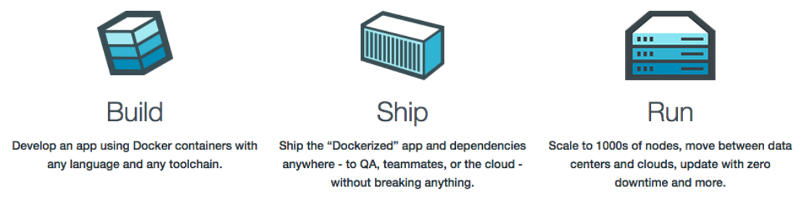

<div align="center">
    
</div>

# :whale: Docker Essentials

Learn Hands-on Containerization and Orchestration with Docker Ecosystem (Docker, Compose and Swarm)

## Summary

- [1. Check docker installation](#1-check-docker-installation)

## 1. Check docker installation

```shell
docker run hello-world

# Output:
# Hello from Docker!
# This message shows that your installation appears to be working correctly.
```

## Stages of Containerization

<div>
    
</div>

<br>

## Architecture and Components

<div>
    
</div>

<br>

<details>
<summary>
nginx on macOS
</summary>

> [Installing Nginx in Mac OS](https://medium.com/@ThomasTan/installing-nginx-in-mac-os-x-maverick-with-homebrew-d8867b7e8a5a)

### Installing

```shell
brew install nginx
```

### Running

```shell
sudo nginx
```

### Stoping

```shell
sudo nginx -s stop
```

</details>

<br>

## Pulling NginX image

[NginX](https://nginx.org/en/), is a web server that can also be used as a reverse proxy, load balancer, mail proxy and HTTP cache.

```shell
docker image pull nginx:latest
```

## Helpful commands

<table>
	<theader>
		<th>Command</th>
		<th>Description</th>
	</theader>
	<tbody>
		<tr>
			<td> $ docker images </td>
			<td> list available docker images </td>
		</tr>
		<tr>
			<td> $ docker container run -itd --name web-server-nginx -p 8080 nginx:latest </td>
			<td> run web application using nginx image / returns a <strong>container id</strong> of nginx container </td>
		</tr>
		<tr>
			<td> $ docker ps -a </td>
			<td> verify if the container is running </td>
		</tr>
		<tr>
			<td> $ docker system prune -a </td>
			<td> delete all containers </td>
		</tr>
		<tr>
			<td> $ docker logs 1234 </td>
			<td> get logs from container passing the container four first id digits </td>
		</tr>
		<tr>
			<td> $ docker stop <container_id> </td>
			<td> kill container (container_id) can be retrieved with the command `docker ps`</td>
		</tr>
	</tbody>
</table>

<br>